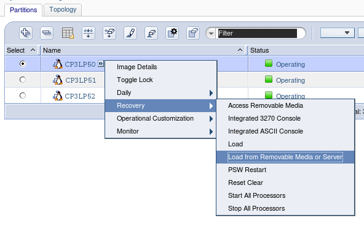
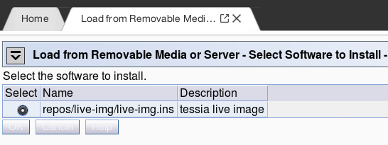
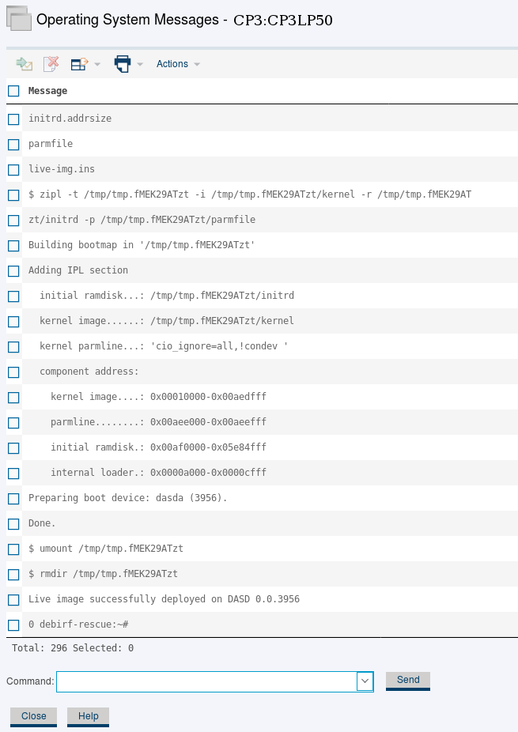

<!--
Copyright 2017 IBM Corp.

Licensed under the Apache License, Version 2.0 (the "License");
you may not use this file except in compliance with the License.
You may obtain a copy of the License at

   http://www.apache.org/licenses/LICENSE-2.0

Unless required by applicable law or agreed to in writing, software
distributed under the License is distributed on an "AS IS" BASIS,
WITHOUT WARRANTIES OR CONDITIONS OF ANY KIND, either express or implied.
See the License for the specific language governing permissions and
limitations under the License.
-->
# Live image to enable HMC netboot

The HMC in classic mode does not expose the FTP network boot capability through its API so in order to
circumvent this limitation we make use of a Linux live image to simulate the functionality.

This works by pre-allocating a DASD/FCP disk for each CPC on which LPARs will must be netbooted.
Here's an overview of the process:

- a target LPAR is IPLed with the pre-allocated disk containing the Linux live image;
- once the Linux system is up, the library takes care of bringing up network connectivity via console commands;
- once network is up, a SSH connection is established;
- the library downloads via shell commands (i.e. `wget`) the target kernel and initrd files (i.e. kernel/initrd from a distro's installer);
- a `kexec` operation is performed to the target files.

On the next sections you can see how the live image can be generated and how to deploy it on a pre-allocated disk
in order to enable the feature.

# How to build the live image

The process is automated by a builder script and done in a docker container, all you need is a s390 Linux system with docker installed.
Simply execute:

```
$ cd tessia-baselib && tools/live-image/build.sh
```

The result is a tarball which should be later extracted to an FTP server, as explained in the section [How to install the live image](#how-to-install-the-live-image).

# How to install the live image

Pre-requisites for this task:

- Reserve a DASD or FCP disk that is accessible by all LPARs in the target CPC. This is going to be the pre-allocated disk which must stay reserved only for this purpose.
- Temporarily allocate an LPAR to be used in the process of installing the live image on the pre-allocated disk.
- Set an FTP server from where the image can be IPLed to the LPAR for the install operation.

Let's assume in this example that we are going to install the live image on the DASD `6500` and use the LPAR `CP3LP50` for the installation process.

First, extract the tarball of the live image containing all the files (kernel, initrd, parmfile, .INS file etc.) to a folder on the FTP server.
Then go to the HMC web interface and choose `Recovery -> Load from Removable Media or Server` as in the example below:



Choose the option `FTP server` and enter your FTP server information (hostname, username, password).
In the field `File path:` enter the path to the *directory* where the tarball was extracted.
Then click the OK button, the HMC should find an .INS file with the description `tessia live image` similar to the example below.
Confirm the operation through the next screens until the LPAR load process starts.



Now open the LPAR console by selecting the LPAR on the web interface list and choosing `Daily -> Operating System Messages`.
The LPAR might still be loading, so maybe you need to wait a few minutes until you see the login prompt.
Type the username `root` and possibly the password (in case you built an image with password).
Finally, execute the disk installer script:

```
$ liveimg-to-disk dasd 6500
```

For a FCP/SCSI disk, instead of `dasd x.y.zzzz` the argument is in the format `fcp adapter,wwpn,lun`.

A confirmation prompt will appear, make sure you specified the correct disk as all data on it will be erased.
The script will attach the disk, partition/format it, extract the tarball containing image files (kernel, initrd, etc.) and install the boot loader.
At the end a successful message is displayed.



The installation process is complete. If you are using the baselib library as a standalone solution you have to point to this disk when doing the library
calls to network boot an LPAR. See the API reference section [Start an LPAR using network boot](hypervisor_hmc.md#start-an-lpar-using-network-boot) for details.

If you installed the disk to use with a tessia server then the installed disk must be associated with the CPC system entry so that the server knows which
disk to use when LPARs on that CPC are to be installed. See the tessia server documentation for details.
